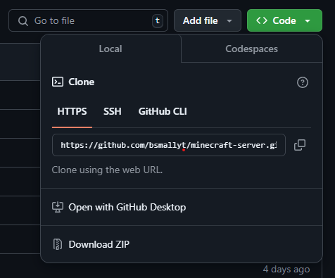
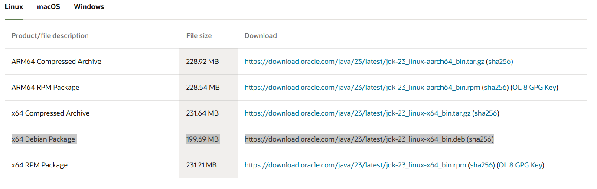
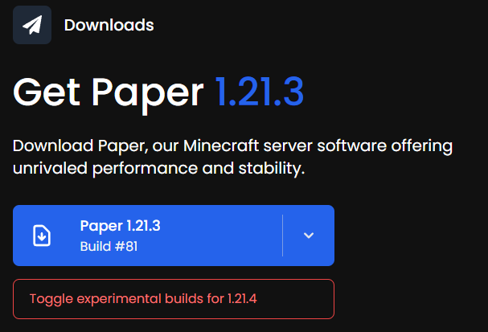

# Minecraft Server 
The following project was made to set up and host a crossplay server between Bedrock and Java editions of minecraft using docker and a few other services. 
This tutorial aims to make setting up a server as simple as possible. 

For the system running the Minecraft server, check suggested system requirements to see if your computer will be okay. 

## Installation
To use the Minecraft Server there will be a few requirememts that need to be met. The following steps will assist you in setting up your personal server. 
1. Docker must be installed on your device. Personally I use Docker desktop, where installation can be found at https://www.docker.com/products/docker-desktop
2. Download this repository as a zip file, by selecting the Code icon found near the center of the screen. The Download ZIP option will now be shown. 

  

3. Once installation is confirmed, navigate to the downloaded folder and extract contents wherever desired.
4. The jdk-23_linux-x64_bin.deb file MUST be replaced with a real installation. Navigate to this page: https://www.oracle.com/java/technologies/downloads. 
Then install the x64 Debian Package (this will not effect your machine). Move the file from the downloads folder and replace the jdk-23_linux-x64_bin.deb file within the project.
(File name doesn't need to be changed.) 

  

5. (Optional Step) If you would like to use a newer paper server version, you can go to this webpage: https://papermc.io/downloads/paper. 
Here you can download the lastest paper server, then replace the paper-1.21.3-81.jar file. (File name doesn't need to be changed.) 

  
  

## Setup
Once everything is installed, follow the steps to setup your server.
1. Open the file location for the server in your terminal. On windows this can be done by opening the file location in File Explorer. 
Then right clicking anywhere in the folder and selecting the Open in Terminal option.
2. Run the following code in the terminal. This step will setup the server within a docker container running on debian. 
The server can be found on bedrock and java at your local ip at `:25565`.
  ```powershell
    docker build -t min-server:latest .
    docker run -p 25565:25565/tcp -p 25565:25565/udp --name min-server min-server:latest
  ```
An assitional code to add to the secound command after `run` and before `-p` is `--restart unless-stopped`. This will restart your server everytime docker is started.
  ```powershell
    docker run --restart unless-stopped -p 25565:25565/tcp -p 25565:25565/udp --name min-server min-server:latest
  ```
To find your local ip, one way is to look up the command used for your system. On windows it's `ipconfig` which can be ran in your terminal.  


## Hosting without Port Forwarding
To host my own server, I use Playit.gg so that I don't have to expose any ports on my own network. The following steps will help you set up your own. 

1. Navigate to the Playit.gg login page and create your own account. https://playit.gg/login
2. Once you hav confirmed your account go to the Agents page, somewhere on the screen there should be an option to add a new docker based agent. Select that option.
3. Name the agent whatever you like.
4. Run the command that they give you in your terminal. It should look something like the following:
```powershell
  docker run --rm -it --net=host -e SECRET_KEY=b510cbbe32d7b9637d1d0cbcbc01328925a0363b2fc8a0cd39d1f0b2697ad0c4 ghcr.io/playit-cloud/playit-agent:0.15
```
Replace `--rm` and place `--restart unless-stopped` if you would like the application to restart itself. And you can add `--name mine-connection` if you would like to name the container. 
You can also name the project whatever you liked by replacing mine-connection with whatever.
```powershell
  docker run --restart unless-stopped --name mine-connection -it --net=host -e SECRET_KEY=b510cbbe32d7b9637d1d0cbcbc01328925a0363b2fc8a0cd39d1f0b2697ad0c4 ghcr.io/playit-cloud/playit-agent:0.15
```
again, DONT actually run those commands, run whatever it gives you.

5. Once the connector has been connected. The page will automatically go to the next step. Select the Add Tunnel selection at the end.
6. Use Shared IP, then change the Tunnel Type to TCP+UDP (protocol)
7. Then change the Local Port to 25565. 
8. Once that is complete the screen will show a Sharable Address. This is what you will use as your server ip address in the game. Should look something like: `inside-hero.gl.at.ply.gg:33542`.

Make sure to give the server a few minutes to be completed and your server will be up and running. 
You can also check Docker Desktop to see if everything is running correctly. Make sure the Actions tab shows a square and if you hover over the icon it gives you the option to stop the container. 

## Additional Resources
In the case that you want to change any of the server properties or add plugins. Logon to the docker with the following command:
```powershell
  docker exec -it min-server bash
```
The server files can be found at `/etc/server/`. Once your finished changing things, run `exit` to log out.
You will probably need to restart the program which can be done by going to docker desktop and toggling the actions column.
